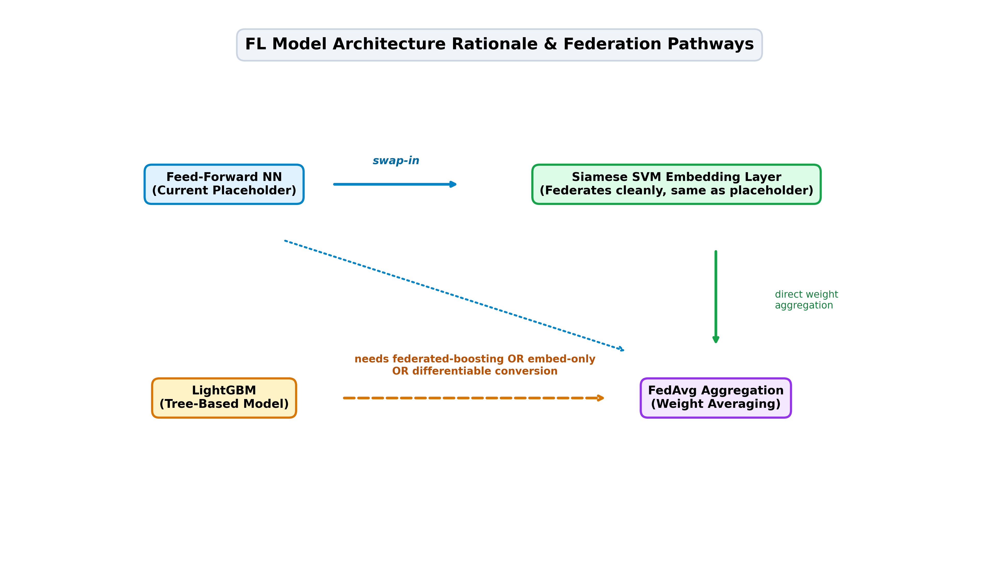

# Model Choice Rationale — Feed-Forward NN Baseline Placeholder

This document details the architectural rationale for utilizing a lightweight **Feed-Forward Neural Network (FFNN)** as the initial baseline placeholder for building and validating the Federated Learning (FL) orchestration infrastructure prior to integrating final model architectures.

## Key Rationale & Architectural Justifications

* **Fixed-Shape Weight Vector Compatibility**: The feed-forward neural network exhibits a deterministic, flat weight vector structure (`(10, 5)` and `(5, 2)` layer weights). This allows seamless compatibility with standard Federated Averaging (`FedAvg`) parameter aggregation without complex tree-structure merging, unlike LightGBM's decision-tree splits.
* **Rapid End-to-End FL Loop Validation**: The lightweight neural network trains in milliseconds per round on synthetic client partitions. This accelerates verification of the complete FL pipeline—from Dirichlet data partitioning to local slice evaluation, MsgPack/JSON telemetry serialization, socket transmission, and server weight aggregation—without waiting on heavy model convergence.
* **Direct Analogy to Siamese SVM Embedding Layer**: The placeholder feed-forward architecture directly mirrors the neural embedding component of the planned Siamese SVM model. Both rely on fixed-weight matrix multiplication layers, making the placeholder a mathematically realistic stand-in for the federated half of the dual-model consensus system.
* **Fallback Target for Hybrid Architecture**: If system trade-offs dictate federating only the neural embedding layer while retaining LightGBM locally (or using federated gradient boosting), the current feed-forward setup serves as the immediate fallback target for the federated pipeline.
* **Resource-Constrained IoT Edge Realism**: Keeping the baseline minimal ensures extremely low CPU/memory overhead and small network payload transfers (under 1 KB per client update), aligning directly with the project's target deployment on resource-constrained edge and IoT devices.

---

## Architectural Flow Diagram

